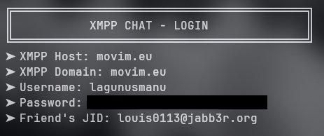
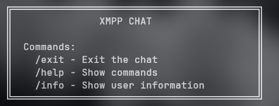
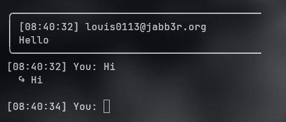
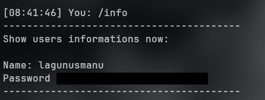
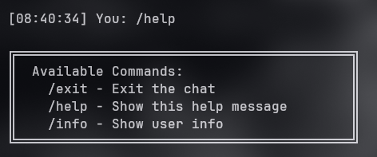
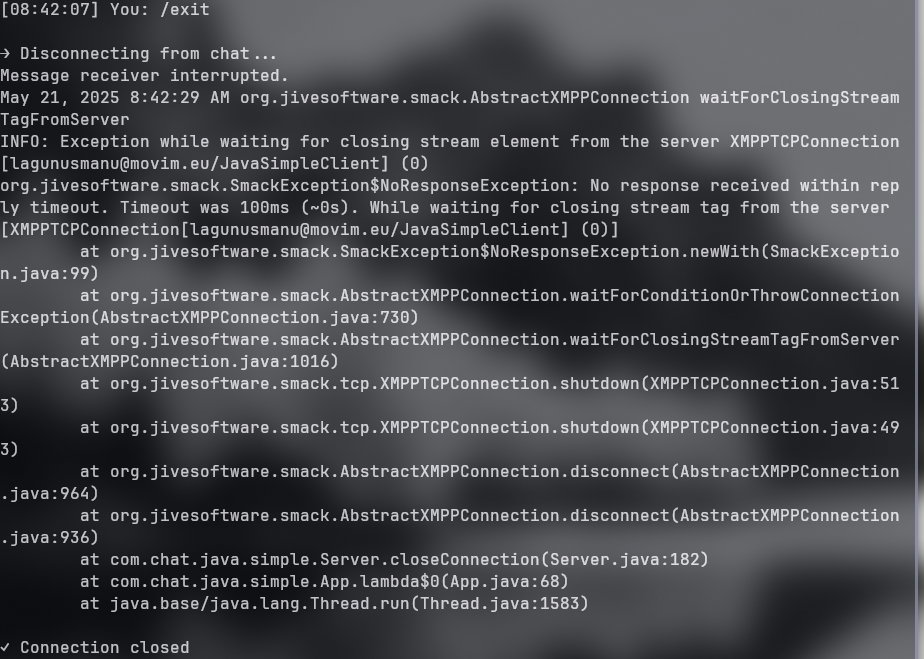

# XMPP Chat CLI made by louis0113
```

                       .,,uod8B8bou,,.
              ..,uod8BBBBBBBBBBBBBBBBRPFT?l!i:.
         ,=m8BBBBBBBBBBBBBBBRPFT?!||||||||||||||
         !...:!TVBBBRPFT||||||||||!!^^""'   ||||
         !.......:!?|||||!!^^""'            ||||
         !.........||||                     ||||
         !.........||||  ##                 ||||
         !.........||||                     ||||
         !.........||||                     ||||
         !.........||||                     ||||
         !.........||||                     ||||
         `.........||||                    ,||||
          .;.......||||               _.-!!|||||
   .,uodWBBBBb.....||||       _.-!!|||||||||!:'
!YBBBBBBBBBBBBBBb..!|||:..-!!|||||||!iof68BBBBBb....
!..YBBBBBBBBBBBBBBb!!||||||||!iof68BBBBBBRPFT?!::   `.
!....YBBBBBBBBBBBBBBbaaitf68BBBBBBRPFT?!:::::::::     `.
!......YBBBBBBBBBBBBBBBBBBBRPFT?!::::::;:!^"`;:::       `.
!........YBBBBBBBBBBRPFT?!::::::::::^''...::::::;         iBBbo.
`..........YBRPFT?!::::::::::::::::::::::::;iof68bo.      WBBBBbo.
  `..........:::::::::::::::::::::::;iof688888888888b.     `YBBBP^'
    `........::::::::::::::::;iof688888888888888888888b.     `
      `......:::::::::;iof688888888888888888888888888888b.
        `....:::;iof688888888888888888888888888888888899fT!
          `..::!8888888888888888888888888888888899fT|!^"'
            `' !!988888888888888888888888899fT|!^"'
                `!!8888888888888888899fT|!^"'
                  `!988888888899fT|!^"'
                    `!9899fT|!^"'
                      `!^"'

```
## Languages:
- Java

---
This is made in Java, otherwise run in everything!
Check bellow:
```
  _ _                  
 | (_)_ __  _   ___  __
 | | | '_ \| | | \ \/ /
 | | | | | | |_| |>  < 
 |_|_|_| |_|\__,_/_/\_\

```
---

```
____ _  _ ___  ____ ____ _ ___  
|__| |\ | |  \ |__/ |  | | |  \ 
|  | | \| |__/ |  \ |__| | |__/ 
```
---
                                
```
 __        ___           _                   
 \ \      / (_)_ __   __| | _____      _____ 
  \ \ /\ / /| | '_ \ / _` |/ _ \ \ /\ / / __|
   \ V  V / | | | | | (_| | (_) \ V  V /\__ \
    \_/\_/  |_|_| |_|\__,_|\___/ \_/\_/ |___/
   
```                                          
---
## Tools:
- Maven
 - Smack
- Aider

## Features:
- Register your credentials
- Receive and send Messages
- Interactive menus
- Simple and clean UI
- Run in any terminal  

## APIs:
- Anthropic API

## Essential Information

### Overview
This is a simple XMPP chat client that runs in the command line interface. It allows users to connect to XMPP servers, register credentials, and exchange messages with other users.

### Requirements
- Java 8 or higher
- Maven for dependency management

### Installation
```bash
# Clone the repository
git clone https://github.com/louis0113/java-chat-cli.git

# Navigate to the project directory
cd java-chat-cli

# Build the project with Maven
mvn clean install
```

### Usage
```bash
# Run the application
java -jar target/simple-java-chat-1.0-SNAPSHOT.jar
```

### Configuration
- Server: Enter your XMPP server address
- Username: Your XMPP username
- Password: Your XMPP password
- Domain: The XMPP domain (usually same as server address)
- Friend's JID: The Jabber ID of the person you want to chat with

### Commands
- `/help` - Display available commands
- `/info` - Show your connection information
- `/exit` - Close the chat and disconnect

## Images:

### Register



### Connection
 


### Menu
  


### Chat



### Info



### Help



### Close


